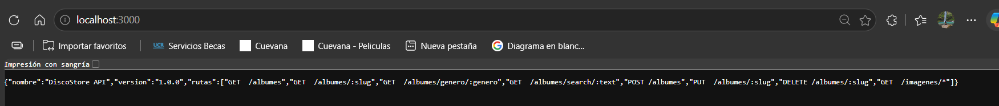
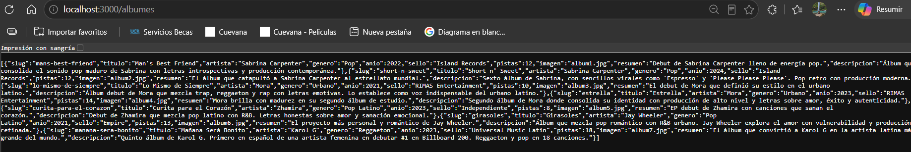
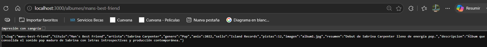
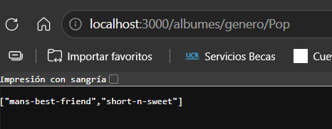
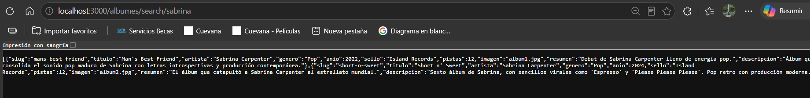
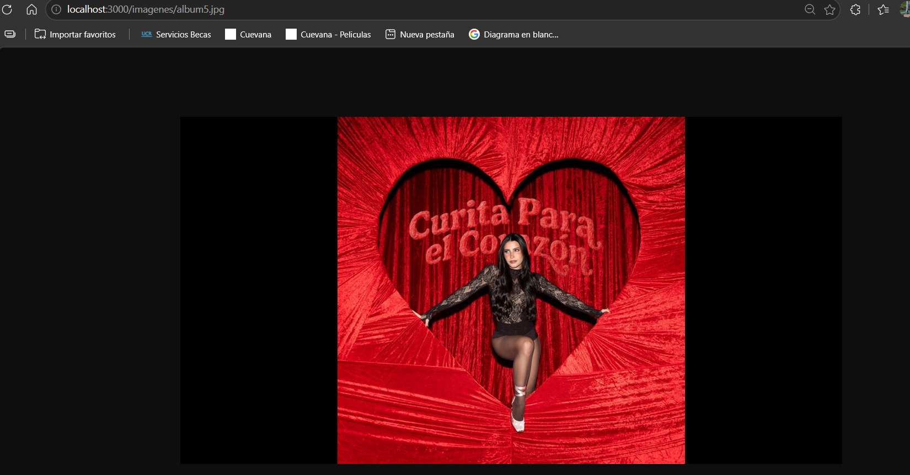

# DiscoStore API

API REST para administrar el catálogo de álbumes de una tienda de música.

```bash
pnpm install
```
Crea un archivo `.env` en la raíz del proyecto:

```
PORT=3000
HOST=localhost
```

```bash
pnpm dev
```

La base de datos se crea y pobla automáticamente al iniciar el servidor por primera vez.

## Rutas

* `/` → Información de la API.
* `/albumes` → Muestra todos los álbumes.
* `/album/:slug` → Muestra un álbum específico.
* `/genero/:genero` → Devuelve los slugs de los álbumes que pertenecen a ese género.
* `/search/:text` → Busca álbumes según el texto ingresado.
* `/albumes` → Crea un nuevo álbum.
* `/album/:slug` → Actualiza los datos de un álbum.
* `/album/:slug` → Elimina un álbum.
* `/imagenes/*` → Permite acceder a las imágenes almacenadas.

## Capturas







